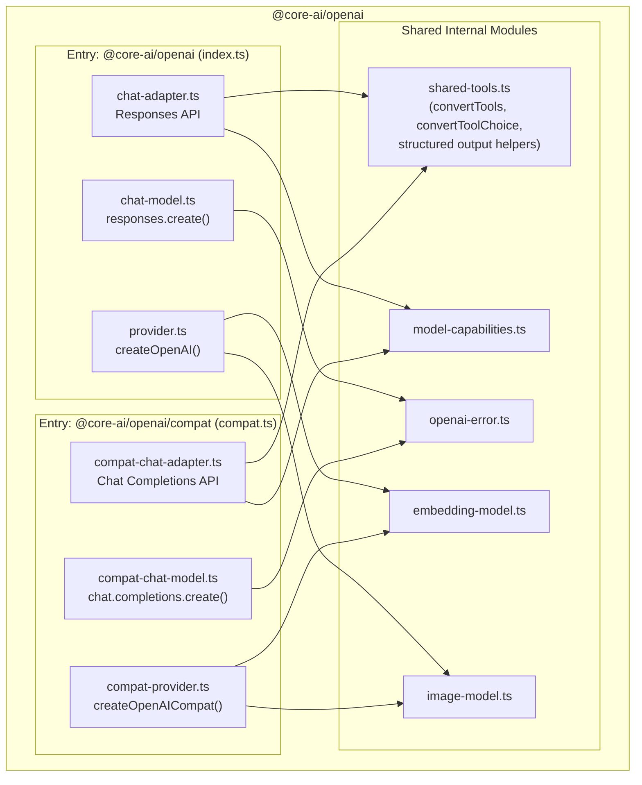
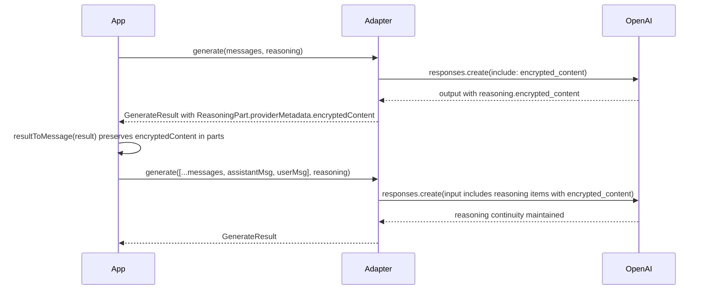

# OpenAI Responses API Migration

**Goal:** Add Responses API support as the default `@core-ai/openai` export for full reasoning support (summaries, encrypted content), while keeping the Chat Completions implementation available via `@core-ai/openai/compat` for compatible providers. Single package, shared internal code, two entry points.

**Prerequisite:** The reasoning support PR must be merged first (or this builds on top of it).

---

## Architecture: Single Package, Two Entry Points



Consumer usage:

```typescript
// Responses API (default) -- for OpenAI and Azure
import { createOpenAI } from '@core-ai/openai';

// Chat Completions API -- for compatible providers (Groq, Together, Ollama, etc.)
import { createOpenAICompat } from '@core-ai/openai/compat';
```

Both return the same `ChatModel` interface. Consumers using the provider-agnostic `generate()`/`stream()` API don't need any code changes beyond the import.

---

## Step 1: Restructure the package

Rename current Chat Completions files to `compat-*` prefixed names, extract shared code, add subpath export.

### File renames

- `chat-adapter.ts` -> `compat-chat-adapter.ts` (current Chat Completions adapter, no logic changes)
- `chat-model.ts` -> `compat-chat-model.ts` (current Chat Completions model, no logic changes)
- `chat-adapter.test.ts` -> `compat-chat-adapter.test.ts`
- `chat-model.test.ts` -> `compat-chat-model.test.ts`

### Extract shared code

Create [packages/openai/src/shared-tools.ts](packages/openai/src/shared-tools.ts) -- extract from current `chat-adapter.ts`:

- `convertTools()` -- tool format is the same in both APIs
- `convertToolChoice()` -- tool choice format is the same
- `createStructuredOutputOptions()` / `getStructuredOutputToolName()` -- same
- `DEFAULT_STRUCTURED_OUTPUT_TOOL_NAME` / `DEFAULT_STRUCTURED_OUTPUT_TOOL_DESCRIPTION` constants

Both `chat-adapter.ts` (Responses) and `compat-chat-adapter.ts` (Chat Completions) import from `shared-tools.ts`.

### New entry point

Create [packages/openai/src/compat.ts](packages/openai/src/compat.ts):

```typescript
export { createOpenAICompat } from './compat-provider.js';
export type {
    OpenAICompatProvider,
    OpenAICompatProviderOptions,
} from './compat-provider.js';
```

Create [packages/openai/src/compat-provider.ts](packages/openai/src/compat-provider.ts) -- same as current `provider.ts` but exports `createOpenAICompat` and uses `compat-chat-model.ts`.

### Package.json changes

```json
{
    "exports": {
        ".": {
            "types": "./dist/index.d.ts",
            "import": "./dist/index.js"
        },
        "./compat": {
            "types": "./dist/compat.d.ts",
            "import": "./dist/compat.js"
        }
    }
}
```

### tsup.config.ts changes

```typescript
export default defineConfig({
    entry: ['src/index.ts', 'src/compat.ts'],
    format: ['esm'],
    dts: true,
    clean: true,
    outDir: 'dist',
});
```

---

## Step 2: Create Responses API adapter

New files for the Responses API implementation.

### [packages/openai/src/chat-adapter.ts](packages/openai/src/chat-adapter.ts) -- new Responses API adapter

**Imports from OpenAI SDK:**

```typescript
import type {
    Response,
    ResponseCreateParamsNonStreaming,
    ResponseCreateParamsStreaming,
    ResponseStreamEvent,
    ResponseInputItem,
    ResponseOutputItem,
    ResponseReasoningItem,
    ResponseOutputMessage,
    ResponseFunctionToolCall,
} from 'openai/resources/responses/responses';
```

**Request building:**

- `convertMessages(messages: Message[]): ResponseInputItem[]` -- convert core-ai messages to Responses API input items:
    - `system` -> `{ role: 'developer', content: text }` (Responses API uses `developer` role)
    - `user` -> `{ role: 'user', content: text | content_parts }`
    - `assistant` -> reconstruct from `parts`: reasoning parts become reasoning input items (with `encrypted_content` from `providerMetadata` -- critical for stateless multi-turn, see below), text parts become message content, tool calls become function call items
    - `tool` -> `{ type: 'function_call_output', call_id, output }`
- `createGenerateRequest(modelId, options)` -> `ResponseCreateParamsNonStreaming`:
    - `model`, `input` (converted messages)
    - `reasoning: { effort, summary: 'auto' }` when reasoning is enabled (always opt into summaries so reasoning output is visible)
    - `include: ['reasoning.encrypted_content']` -- **always included when reasoning is enabled**, not just in explicit stateless mode. The org may have zero data retention enabled at the account level without the adapter knowing. Including this unconditionally is safe (it's a no-op when the server stores data) and ensures multi-turn reasoning works regardless of retention settings.
    - `store` -- passed through from `providerOptions` when set. Users with data sensitivity set `providerOptions: { store: false }` to disable server-side storage.
    - `tools` (via shared `convertTools()`), `tool_choice` (via shared `convertToolChoice()`)
    - Config fields: `max_output_tokens`, `temperature`, `top_p`
- `createStreamRequest(modelId, options)` -> `ResponseCreateParamsStreaming`: same plus `stream: true`

**Response parsing:**

- `mapGenerateResponse(response: Response): GenerateResult` -- iterate `response.output`:
    - `ResponseReasoningItem` (type `'reasoning'`) -> `ReasoningPart` with:
        - `text`: concatenate `item.summary[].text`
        - `providerMetadata.encryptedContent`: from `item.encrypted_content` when present. This is the encrypted reasoning token payload needed for multi-turn pass-back in stateless mode. When `null`/absent (server is storing data and manages state), this field is omitted from providerMetadata.
    - `ResponseOutputMessage` (type `'message'`) -> text parts from `item.content[]` where type is `'output_text'`
    - `ResponseFunctionToolCall` (type `'function_call'`) -> `ToolCall` part with `name`, `arguments` (parsed from JSON string), `id` from `call_id`
    - Build `parts` array preserving output order
    - Derive `content`, `reasoning`, `toolCalls` from parts
    - Usage from `response.usage`: `input_tokens`, `output_tokens`, `output_tokens_details.reasoning_tokens`

**Stream transformation:**

- `transformStream(stream: AsyncIterable<ResponseStreamEvent>): AsyncIterable<StreamEvent>`:
    - `response.reasoning_summary_text.delta` -> emit `reasoning-start` (on first delta), then `reasoning-delta` with `event.delta`
    - `response.reasoning_summary_text.done` -> emit `reasoning-end`
    - `response.output_text.delta` -> emit `text-delta` with `event.delta`
    - `response.function_call_arguments.delta` -> buffer and emit `tool-call-delta`
    - `response.output_item.done` where item is `function_call` -> emit `tool-call-end` with parsed `ToolCall`
    - `response.completed` -> emit `finish` with `finishReason` and `usage`
    - Track `toolCallId`/`toolName` from `response.output_item.added` events for tool call correlation

**Validation** -- reuse `validateOpenAIReasoningConfig()` from current implementation (same logic, imports from `model-capabilities.ts`).

### [packages/openai/src/chat-model.ts](packages/openai/src/chat-model.ts) -- new Responses API model

Same structure as current `chat-model.ts` but uses `client.responses.create()`:

```typescript
type OpenAIChatClient = {
    responses: OpenAI['responses'];
};
```

- `generateChat`: calls `client.responses.create(request)` (non-streaming), maps with `mapGenerateResponse()`
- `streamChat`: calls `client.responses.create(request)` (streaming), transforms with `transformStream()`
- Structured output logic (generateObject, streamObject) stays identical -- it operates on `GenerateResult` and `StreamResult`, which are API-agnostic

### [packages/openai/src/provider.ts](packages/openai/src/provider.ts) -- updated for Responses API

The main `createOpenAI()` now creates chat models via the Responses API `chat-model.ts`. The client type passed to `createOpenAIChatModel` uses `client.responses` instead of `client.chat`.

`baseURL` remains supported (Azure hosts the Responses API).

---

## Step 3: Tests

### Responses API tests (new)

`**chat-adapter.test.ts`:\*\*

- `convertMessages`: system -> developer role, assistant with reasoning parts -> reasoning input items with encrypted_content, tool results -> function_call_output
- `convertMessages` (stateless round-trip): assistant message with reasoning parts carrying `providerMetadata.encryptedContent` -> reasoning input items with `encrypted_content` field populated, verifying the full multi-turn round-trip fidelity
- `createGenerateRequest`: reasoning.summary set to 'auto', include has `reasoning.encrypted_content`, effort mapping via capabilities
- `createGenerateRequest` (stateless): `store: false` passed through from providerOptions; `include` always has `reasoning.encrypted_content` regardless of store setting
- `mapGenerateResponse`: reasoning items with `encrypted_content` -> ReasoningPart with `providerMetadata.encryptedContent`; reasoning items without `encrypted_content` (stored mode) -> ReasoningPart without encryptedContent in metadata; message items -> text parts; function_call items -> tool call parts; usage mapping
- `transformStream`: reasoning summary deltas -> reasoning-start/delta/end, text deltas -> text-delta, function call deltas -> tool-call-delta/end, completed -> finish
- `validateOpenAIReasoningConfig`: ProviderError for temperature/topP on restrictsSamplingParams models

`**chat-model.test.ts`:\*\*

- Mock `client.responses.create()` (non-streaming and streaming)
- Generate: verify Response mapped to GenerateResult correctly
- Generate (stateless): verify reasoning parts carry `encryptedContent` through the full generate -> resultToMessage -> generate round-trip
- Stream: verify ResponseStreamEvent sequence mapped to StreamEvent sequence
- Structured output: verify tool-based extraction works with Responses API response shape

### Chat Completions tests (moved)

`**compat-chat-adapter.test.ts`** and `**compat-chat-model.test.ts`**: renamed from current test files, update imports to `compat-\*` modules. No logic changes.

---

## Step 4: Update E2E and examples

- E2E adapter (`tests/e2e/src/adapters/openai.adapter.ts`) imports from `@core-ai/openai` -- now uses Responses API transparently. No code change needed.
- Examples use `@core-ai/openai` -- same, transparent upgrade.
- Consider adding an E2E adapter for `@core-ai/openai/compat` to verify Chat Completions still works.

---

## File Summary

| File                                         | Status                                                     |
| -------------------------------------------- | ---------------------------------------------------------- |
| `packages/openai/package.json`               | Update exports, tsup entry                                 |
| `packages/openai/tsup.config.ts`             | Add `compat.ts` entry                                      |
| `packages/openai/src/shared-tools.ts`        | **New** -- extracted shared tool/structured output helpers |
| `packages/openai/src/chat-adapter.ts`        | **New** -- Responses API adapter                           |
| `packages/openai/src/chat-model.ts`          | **New** -- Responses API model                             |
| `packages/openai/src/provider.ts`            | Updated to use Responses API chat model                    |
| `packages/openai/src/index.ts`               | No change (still exports createOpenAI)                     |
| `packages/openai/src/compat.ts`              | **New** -- compat entry point                              |
| `packages/openai/src/compat-provider.ts`     | **New** -- createOpenAICompat factory                      |
| `packages/openai/src/compat-chat-adapter.ts` | **Renamed** from chat-adapter.ts (no logic changes)        |
| `packages/openai/src/compat-chat-model.ts`   | **Renamed** from chat-model.ts (no logic changes)          |
| `packages/openai/src/model-capabilities.ts`  | No change (shared)                                         |
| `packages/openai/src/openai-error.ts`        | No change (shared)                                         |
| `packages/openai/src/embedding-model.ts`     | No change (shared)                                         |
| `packages/openai/src/image-model.ts`         | No change (shared)                                         |
| Test files                                   | Renamed compat tests, new Responses API tests              |

---

## Stateless Mode and Zero Data Retention

This is a critical concern for data-sensitive users. OpenAI's Responses API can operate in two storage modes:

- **Stored mode** (default): OpenAI retains request/response data. The server manages reasoning state between turns via `previous_response_id`. Multi-turn "just works."
- **Stateless mode**: Triggered by `store: false` on the request, or when the organization has **zero data retention (ZDR)** enrolled at the account level. OpenAI does **not** retain any data between requests.

In stateless mode, reasoning tokens are discarded after each request. For multi-turn conversations to maintain reasoning continuity, the client must:

1. **Request encrypted reasoning content** by including `reasoning.encrypted_content` in the `include` parameter
2. **Capture the `encrypted_content`** from each `ResponseReasoningItem` in the response
3. **Pass it back** as reasoning input items in subsequent requests

### How our adapter handles this

The adapter **always** includes `reasoning.encrypted_content` in the `include` parameter when reasoning is enabled. This is safe in stored mode (the field is simply populated but not needed) and essential in stateless mode. We do this unconditionally because:

- The adapter cannot detect whether the org has ZDR enabled -- it's an account-level setting
- Including it when not needed has no performance or cost impact
- Not including it when needed silently degrades multi-turn reasoning quality

The full data flow for stateless multi-turn:



The key integration point is `resultToMessage()` -- it preserves `providerMetadata` (including `encryptedContent`) on reasoning parts. When the adapter converts those parts back to Responses API input items, it reconstructs the reasoning input items with `encrypted_content`, maintaining full reasoning continuity.

### Consumer usage for stateless mode

```typescript
const result = await generate({
    model: chatModel,
    messages,
    reasoning: { effort: 'high' },
    providerOptions: { store: false }, // explicit stateless mode
});

// resultToMessage() preserves encrypted reasoning content automatically
const nextMessages = [
    ...messages,
    resultToMessage(result),
    { role: 'user' as const, content: 'Follow-up question...' },
];

// Multi-turn reasoning works even without server-side storage
const followUp = await generate({
    model: chatModel,
    messages: nextMessages,
    reasoning: { effort: 'high' },
    providerOptions: { store: false },
});
```

For orgs with ZDR, the same flow works without needing `providerOptions: { store: false }` -- the adapter handles it transparently.

---

## What Consumers Need to Do

- **Using OpenAI directly:** No change. `import { createOpenAI } from '@core-ai/openai'` still works, now backed by Responses API. `result.reasoning` will now be populated with reasoning summaries. Multi-turn reasoning works automatically, including in stateless/ZDR configurations.
- **Using compatible endpoints (Groq, Together, Ollama, etc.):** Change import to `import { createOpenAICompat } from '@core-ai/openai/compat'`.
- **Using Azure OpenAI:** No change. `createOpenAI({ baseURL: '...' })` works -- Azure supports the Responses API.
- **Data-sensitive users (ZDR / stateless):** No special handling needed. The adapter always requests encrypted reasoning content and `resultToMessage()` preserves it. For explicit stateless mode, pass `providerOptions: { store: false }`.

---

## Breaking Changes

1. `**@core-ai/openai` default export now uses Responses API\*\* -- consumers using `baseURL` with non-OpenAI/non-Azure endpoints must switch to `@core-ai/openai/compat`
2. **Compat export uses different function name** -- `createOpenAICompat()` instead of `createOpenAI()` to avoid ambiguity when both are imported
