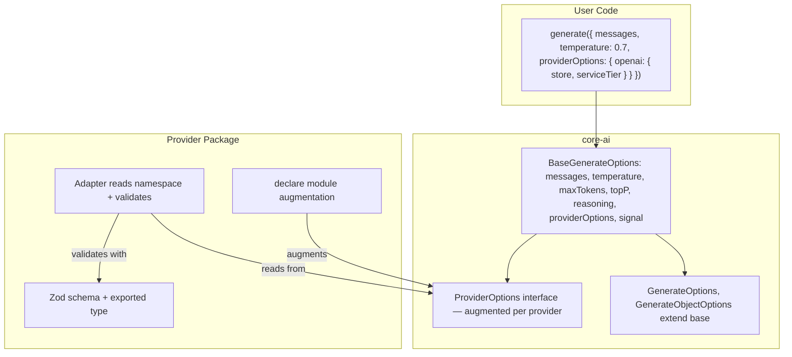

# Provider-Specific Typed Options

## Design

### Problem

`ModelConfig` pretends six sampling fields are universal, but they aren't. `providerOptions` is `Record<string, unknown>` with no type safety. Together they cause silent misconfigurations.

### Solution: Two-Tier Options



**Tier 1 — Flattened universal fields** on a shared `BaseGenerateOptions`:

```typescript
export type BaseGenerateOptions = {
    messages: Message[];
    temperature?: number;
    maxTokens?: number;
    topP?: number;
    reasoning?: ReasoningConfig;
    providerOptions?: ProviderOptions;
    signal?: AbortSignal;
};

export type GenerateOptions = BaseGenerateOptions & {
    tools?: ToolSet;
    toolChoice?: ToolChoice;
};

export type GenerateObjectOptions<TSchema extends z.ZodType> = BaseGenerateOptions & {
    schema: TSchema;
    schemaName?: string;
    schemaDescription?: string;
};

export type StreamObjectOptions<TSchema extends z.ZodType> = GenerateObjectOptions<TSchema>;
```

`ModelConfig` is removed entirely. `temperature`, `maxTokens`, `topP` live directly on the base type. `stopSequences`, `frequencyPenalty`, `presencePenalty` move to provider-specific options.

**Tier 2 — Namespaced `ProviderOptions`** with declaration merging and Zod validation:

```typescript
// core-ai/types.ts
export interface ProviderOptions {
    [key: string]: Record<string, unknown> | undefined;
}
```

This is an `interface` (not `type`) to enable declaration merging. The index signature allows arbitrary providers while augmented providers get full type safety.

Each provider package augments it:

```typescript
// @core-ai/openai
import { z } from 'zod';

export const openaiResponsesOptionsSchema = z.object({
    store: z.boolean().optional(),
    serviceTier: z.enum(['auto', 'flex', 'priority', 'default']).optional(),
    include: z.array(z.string()).optional(),
    parallelToolCalls: z.boolean().optional(),
    user: z.string().optional(),
});

export type OpenAIResponsesProviderOptions = z.infer<typeof openaiResponsesOptionsSchema>;

declare module '@core-ai/core-ai' {
    interface ProviderOptions {
        openai?: OpenAIResponsesProviderOptions;
    }
}
```

Providers read from their namespace and validate at runtime:

```typescript
function getOpenAIOptions(providerOptions?: ProviderOptions) {
    const raw = providerOptions?.openai;
    if (!raw) return undefined;
    return openaiResponsesOptionsSchema.parse(raw);
}
```

### What Each Provider Gets

**OpenAI Responses** (`providerOptions.openai`):

- `store`, `serviceTier`, `include`, `parallelToolCalls`, `user`

**OpenAI Compat** (`providerOptions.openai`): same namespace, superset schema at runtime:

- Everything above + `stopSequences`, `frequencyPenalty`, `presencePenalty`, `seed`

For the TypeScript type, `OpenAIResponsesProviderOptions` (the default) would be the type used in declaration merging. Users of the compat adapter can use `satisfies OpenAICompatProviderOptions` which the compat module exports separately. At runtime, each adapter validates with its own Zod schema, so passing `frequencyPenalty` to the Responses adapter will produce a clear Zod validation error.

**Anthropic** (`providerOptions.anthropic`):

- `topK`, `stopSequences`, `betas`, `outputConfig`

**Mistral** (`providerOptions.mistral`):

- `stopSequences`, `frequencyPenalty`, `presencePenalty`

**Google** (`providerOptions.google`):

- `stopSequences`, `frequencyPenalty`, `presencePenalty`, `topK`, plus the existing nested `config` for `thinkingConfig` etc.

### Key Design Decisions

- `**interface` for `ProviderOptions`**: Required for declaration merging. This is the one exception to the "prefer `type`" convention.
- **Index signature on the base interface**: `[key: string]: Record<string, unknown> | undefined` allows custom/unknown providers without casting, while augmented providers get full autocomplete.
- **Zod validation per adapter, not in core**: Core stays lightweight — no runtime Zod parsing in `core-ai`. Each provider validates its own options. This keeps the dependency graph clean.
- **Single `openai` namespace for both Responses and Compat**: The exported type matches the default (Responses) adapter. Compat exports a separate type for `satisfies` usage. Runtime Zod schemas differ per adapter.
- **No `parseProviderOptions` utility in core**: The namespaced access is trivial (`providerOptions?.openai`), so a utility function adds no value. Each provider does `schema.parse()` locally.

## Files Changed

### core-ai

- [packages/core-ai/src/types.ts](packages/core-ai/src/types.ts): Remove `ModelConfig` type. Add `BaseGenerateOptions` with flattened `temperature`, `maxTokens`, `topP` + shared fields. Redefine `GenerateOptions` and `GenerateObjectOptions` as intersections with the base. Add `ProviderOptions` interface. Update `EmbedOptions` and `ImageGenerateOptions` to use `ProviderOptions`.
- [packages/core-ai/src/index.ts](packages/core-ai/src/index.ts): Remove `ModelConfig` export. Add `BaseGenerateOptions` and `ProviderOptions` exports.

### OpenAI

- New file `packages/openai/src/provider-options.ts`: Zod schemas for Responses and Compat options, exported types, `declare module` augmentation.
- [packages/openai/src/chat-adapter.ts](packages/openai/src/chat-adapter.ts): Remove `UNSUPPORTED_RESPONSES_API_CONFIG_FIELDS` and `mapConfigToRequestFields`. Read `options.temperature` / `options.maxTokens` / `options.topP` directly. Replace flat `providerOptions` spread with namespaced read + Zod validation. Remove `ProviderError` import added in the earlier fix.
- [packages/openai/src/compat/chat-adapter.ts](packages/openai/src/compat/chat-adapter.ts): Same pattern — read universal fields directly from options, read `providerOptions?.openai` for compat-specific fields (frequencyPenalty, presencePenalty, stopSequences), validate with compat schema.
- [packages/openai/src/chat-adapter.test.ts](packages/openai/src/chat-adapter.test.ts): Update `providerOptions` in tests to use `{ openai: { ... } }` shape. Add tests for Zod validation errors on invalid options.
- [packages/openai/src/compat/chat-adapter.test.ts](packages/openai/src/compat/chat-adapter.test.ts): Same.
- [packages/openai/src/embedding-model.ts](packages/openai/src/embedding-model.ts), [packages/openai/src/image-model.ts](packages/openai/src/image-model.ts): Update to read from `providerOptions?.openai`.
- [packages/openai/src/shared/tools.ts](packages/openai/src/shared/tools.ts): Update `createStructuredOutputOptions` to pass through flattened fields (`temperature`, `maxTokens`, `topP`) instead of `config`.
- [packages/openai/src/index.ts](packages/openai/src/index.ts): Re-export provider option types.

### Anthropic

- New file `packages/anthropic/src/provider-options.ts`: Zod schema, exported type, `declare module` augmentation.
- [packages/anthropic/src/chat-adapter.ts](packages/anthropic/src/chat-adapter.ts): Replace `mergeProviderOptions` with namespaced read + Zod validation. Read universal fields directly from options. Map `stopSequences` from provider options instead of the old `config`.
- [packages/anthropic/src/chat-adapter.test.ts](packages/anthropic/src/chat-adapter.test.ts): Update tests.
- [packages/anthropic/src/index.ts](packages/anthropic/src/index.ts): Re-export types.

### Mistral

- New file `packages/mistral/src/provider-options.ts`: Zod schema, type, augmentation.
- [packages/mistral/src/chat-adapter.ts](packages/mistral/src/chat-adapter.ts): Namespaced read + validation. Read universal fields directly from options. Map `stopSequences`, `frequencyPenalty`, `presencePenalty` from `providerOptions?.mistral`. Replace `mergeProviderOptions` with explicit mapping.
- [packages/mistral/src/embedding-model.ts](packages/mistral/src/embedding-model.ts): Update to `providerOptions?.mistral`.
- [packages/mistral/src/index.ts](packages/mistral/src/index.ts): Re-export types.

### Google

- New file `packages/google-genai/src/provider-options.ts`: Zod schema, type, augmentation.
- [packages/google-genai/src/chat-adapter.ts](packages/google-genai/src/chat-adapter.ts): Read universal fields directly from options. Map `stopSequences`, `frequencyPenalty`, `presencePenalty` from `providerOptions?.google`. Replace manual `providerOptions` merging with namespaced read + validation.
- [packages/google-genai/src/chat-adapter.test.ts](packages/google-genai/src/chat-adapter.test.ts): Update tests.
- [packages/google-genai/src/embedding-model.ts](packages/google-genai/src/embedding-model.ts), [packages/google-genai/src/image-model.ts](packages/google-genai/src/image-model.ts): Update to `providerOptions?.google`.
- [packages/google-genai/src/index.ts](packages/google-genai/src/index.ts): Re-export types.

### Changeset

Add a changeset for the breaking change across `@core-ai/core-ai` (major) and all provider packages (major).